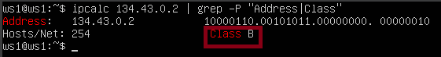
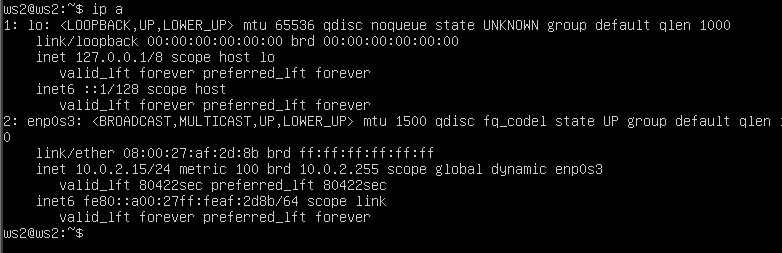
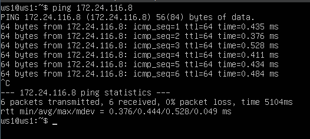
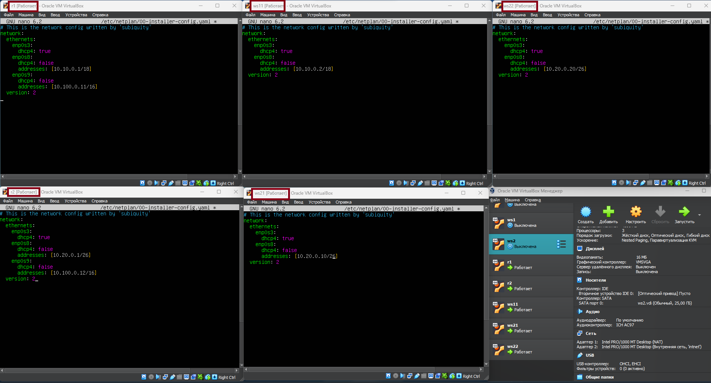
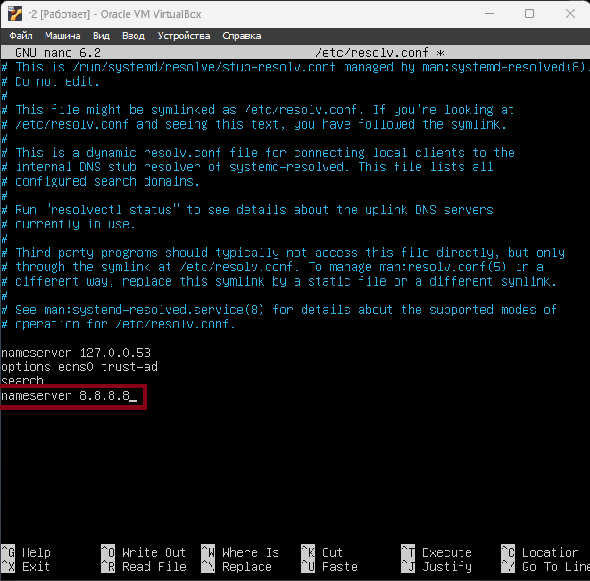
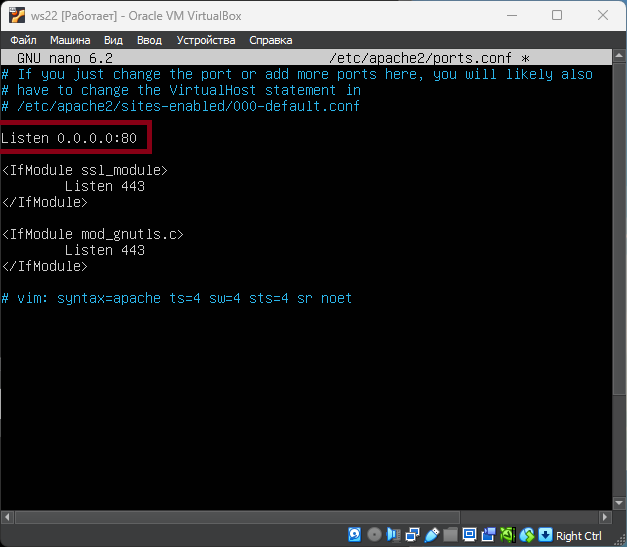
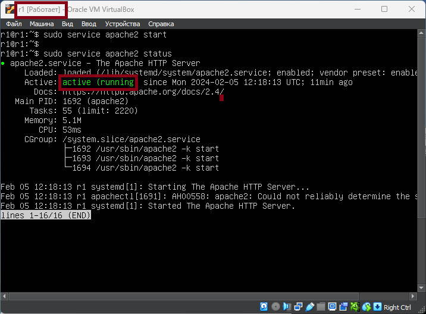

# DO2_LinuxNetwork
## Part1. Инструмент ipcalc

```
sudo apt install ipcalc
```

- ipcalc - это утилита командной строки, используемая для анализа и работы с IP-адресами и подсетями. Она предоставляет информацию о сетевых параметрах, таких как адрес сети, широковещательный адрес, количество хостов, а также о маске подсети и диапазоне IP-адресов.

### 1.1 Сети и Маски

1. адрес сети 192.167.38.54/13:


2. перевод маски `255.255.255.0` в префексную и двоичню запись, `/15` в обычную и двоичную, `11111111.11111111.11111111.11110000` в обычную и префексную.

- Префесканая и обычная запись маски `255.255.255.0`:


- Обычная и двоичная запись `/15`:


- Обычная и префексная запись маски `11111111.11111111.11111111.11110000` (/28):


3. Минимальный и максимальный хост в сети 12.167.38.4 при масках: /8, 11111111.11111111.00000000.00000000, 255.255.254.0 и /4

- Маска `/8`:


- Маска `11111111.11111111.00000000.00000000` (/16):


- Маска `255.255.254.0`:


- Маска `/4`:


### 1.2 localhost

1. Определи и запиши в отчёт, можно ли обратиться к приложению, работающему на localhost, со следующими IP: `194.34.23.100`, `127.0.0.2`, `127.1.0.1`, `128.0.0.1`

- Из прошлого проекта мы выяснили, что lo (loopback device) – виртуальный интерфейс, присутствующий по умолчанию в любом Linux. Он используется для отладки сетевых программ и запуска серверных приложений на локальной машине. С этим интерфейсом всегда связан адрес 127.0.0.1. У него есть dns-имя – localhost.

- `194.34.23.100`:


Нельзя

- `127.0.0.2`:


Можно

- `127.1.0.1`:


Можно

- `128.0.0.1`:


Нельзя

### 1.3 Диапазоны и сегменты сетей.

1. какие из перечисленных IP можно использовать в качестве публичного, а какие только в качестве частных: 10.0.0.45, 134.43.0.2, 192.168.4.2, 172.20.250.4, 172.0.2.1, 192.172.0.1, 172.68.0.2, 172.16.255.255, 10.10.10.10, 192.169.168.1

- IP бывают белые и серые (или публичные и частные). Публичным IP адресом называется IP адрес, который используется для выхода в Интернет. Адреса, используемые в локальных сетях, относят к частным. Частные IP не маршрутизируются в Интернете.

Класс А: `1.0.0.0 — 126.0.0.0`, маска `255.0.0.0`

Класс В: `128.0.0.0 — 191.255.0.0`, маска `255.255.0.0`

Класс С: `192.0.0.0 — 223.255.255.0`, маска `255.255.255.0`

Класс D: `224.0.0.0 — 239.255.255.255`, маска `255.255.255.255`

Класс Е: `240.0.0.0 — 247.255.255.255`, маска `255.255.255.255`\

- Публичные IP-адреса:

Диапазон A: 1.0.0.0 - 126.255.255.255
Диапазон B: 128.0.0.0 - 191.255.255.255
Диапазон C: 192.0.0.0 - 223.255.255.255

- Частные IP-адреса:

Диапазон A: 10.0.0.0 - 10.255.255.255
Диапазон B: 172.16.0.0 - 172.31.255.255
Диапазон C: 192.168.0.0 - 192.168.255.255

- `10.0.0.45`:


Только частные сети

- `134.43.0.2`:



Можно использовать в качестве публичного

- `192.168.4.2`:


Только частные сети

- `172.20.250.4`:


Только чатсные сети

- `172.0.2.1`:


Можно использовать в качестве публичного

- `192.172.0.1`:


Можно использовать в качестве публичного

- `172.68.0.2`:


Можно использовать в качестве публичного

- `172.16.255.255`:


Только чатсные сети

- `10.10.10.10`:


Только чатсные сети

- `192.169.168.1`:


Можно использовать в качестве публичного

2. Какие из перечисленных IP адресов шлюза возможны у сети `10.10.0.0/18`: `10.0.0.1`, `10.10.0.2`, `10.10.10.10`, `10.10.100.1`, `10.10.1.255`


Можно использовать адреса: `10.10.0.2`, `10.10.10.10`, `10.10.1.255`.

## Part 2. Статическая маршрутизация между двумя машинами

1. Поднять 2 виртуальные машины.


2. С помощью команды `ip a` посмотреть существующие сетевые интерфейсы:

- ws1:


- ws2:



3. Описать сетевой интерфейс, соответствующий внутренней сети, на обеих машинах и задать следующие адреса и маски: ws1 - 192.168.100.10, маска /16, ws2 - 172.24.116.8, маска /12.

- В настройках кажной VM ставим внутреннюю сеть:

- ws1: 


- ws2:


- Интерфейс `enp0s3` используется для подключения виртуальной машины к сети, а `enp0s8` используется для создания отдельной виртуальной сети между виртуальными машинами.

- IP-адресс и маска ws1:


- IP-адресс и маска ws2:


4. Выполним команду `sudo netplan apply`

- ws1:


- ws2:


### 2.1 Добавление статического маршрута вручную

1. Добавь статический маршрут от одной машины до другой и обратно при помощи команды вида `ip r add`.

- ws1:


- ws2:


2. Пропингуем соединение между машинами:

- ws1:


- ws2:


### 2.2 Добавление статического маршрута с сохранением

`sudo reboot`

1. Добавить статический маршрут от одной машины до другой с помощью файла `etc/netplan/00-installer-config.yaml`

- ws1:


- ws2:


2. Пропинговать соединение между машинами:

- ws1:


- ws2:


## Part 3. Утилита iperf3.

### 3.1 Скорость соединения

1. Переведи и запиши в отчёт: 8 Mbps в MB/s, 100 MB/s в Kbps, 1 Gbps в Mbps.

-  8 Mbps = 1 MB/s.

- 100 MB/s = 100000 Kbps.

- 1 Gbps = 1000 Mbps.

### 3.2 Утилита iperf3

1. Измерь скорость соединения между ws1 и ws2.

- `sudo apt install iperf3`

- Используем ws1, как клиент:


`iperf3 -c 172.24.116.8` - используется для запуска iperf3 в режиме клиента (client mode). Она позволяет клиенту iperf3 установить соединение с сервером, чтобы измерить пропускную способность или другие сетевые характеристики между клиентом и сервером.

- А ws2 - как сервер:


`iperf3 -s` - выполняется, сервер iperf3 начинает прослушивать определенный порт (по умолчанию порт 5201) и ожидает входящих соединений от клиентов. Когда клиент iperf3 устанавливает соединение с сервером, они могут начать передачу тестового сетевого трафика между собой.

## Part 4. Сутевой экран

### 4.1 Утилита iptables

1. На ws1 примени стратегию, когда в начале пишется запрещающее правило, а в конце пишется разрешающее правило (это касается пунктов 4 и 5).

2. На ws2 примени стратегию, когда в начале пишется разрешающее правило, а в конце пишется запрещающее правило (это касается пунктов 4 и 5).

3. Открой на машинах доступ для порта 22 (ssh) и порта 80 (http).

4. Запрети `echo reply` (машина не должна «пинговаться», т.е. должна быть блокировка на OUTPUT).

5. Разреши `echo reply` (машина должна «пинговаться»).

- Скрипт на ws1:


```
iptables -F
iptables -X
```
- Эти команды очищают все правила в таблице "filter" и удаляют все пользовательские цепочки.

```
iptables -A INPUT -p tcp --dport 22 -j ACCEPT
iptables -A OUTPUT -p tcp --sport 22 -j ACCEPT
iptables -A INPUT -p tcp --dport 80 -j ACCEPT
iptables -A OUTPUT -p tcp --sport 80 -j ACCEPT
```

- Эти команды разрешают входящий и исходящий трафик через порты 22 (SSH) и 80 (HTTP) для TCP-протокола. Флаг -A означает добавление правила в цепочку. Опция -p tcp указывает, что применяется TCP-протокол. Опция --dport указывает на порт назначения, а --sport указывает на порт отправителя. Флаг -j ACCEPT указывает на то, что пакеты, соответствующие этому правилу, должны быть разрешены.

`iptables -A OUTPUT -p icmp --icmp-type echo-reply -j REJECT`

- Это правило блокирует исходящие ICMP-пакеты типа "echo-reply" (также известные как пинг-ответы). Флаг -p icmp указывает, что применяется протокол ICMP. Опция --icmp-type echo-reply указывает на тип ICMP-пакета "echo-reply". Флаг -j REJECT указывает на то, что пакеты, соответствующие этому правилу, должны быть отклонены.

`iptables -A OUTPUT -p icmp --icmp-type echo-reply -j ACCEPT`

- Это правило разрешает исходящие ICMP-пакеты типа "echo-reply" (пинг-ответы). Флаг -p icmp указывает, что применяется протокол ICMP. Опция --icmp-type echo-reply указывает на тип ICMP-пакета "echo-reply". Флаг -j ACCEPT указывает на то, что пакеты, соответствующие этому правилу, должны быть разрешены.

- Скрипт на ws2:


`iptables -A OUTPUT -p icmp --icmp-type echo-reply -j ACCEPT`

- Это правило разрешает исходящие ICMP-пакеты типа "echo-reply" (пинг-ответы). Флаг -p icmp указывает, что применяется протокол ICMP. Опция --icmp-type echo-reply указывает на тип ICMP-пакета "echo-reply". Флаг -j ACCEPT указывает на то, что пакеты, соответствующие этому правилу, должны быть разрешены.

`iptables -A OUTPUT -p icmp --icmp-type echo-reply -j REJECT`

- Это правило блокирует исходящие ICMP-пакеты типа "echo-reply" (также известные как пинг-ответы). Флаг -p icmp указывает, что применяется протокол ICMP. Опция --icmp-type echo-reply указывает на тип ICMP-пакета "echo-reply". Флаг -j REJECT указывает на то, что пакеты, соответствующие этому правилу, должны быть отклонены.

- Выполнение скрипта:


- Утилита iptables работает так, что она задействует правила на выплнения только те, которые встречаются в первом вхождении, а остальные игнорирует. Это означает, что когда пакет проходит через цепочку правил iptables, она проверяет каждое правило последовательно сверху вниз до первого совпадения.

### 4.2 Утилита nmap

1. Командой ping найди машину, которая не «пингуется», после чего утилитой nmap покажи, что хост машины запущен.

- Пропингуем соединение со второй виртуальной машиной:



- Пингуется

- Пропингуем соединение с первой виртуальной машиной:


- Не пингуется

2. Утилита Nmap

- Сканирование nmap для второй виртальной машины:


- Сканирование nmap для первой виртуальной машины:


## Part 5. Статическая маршрутизация сети

1. Сеть 


- Подними пять виртуальных машин (3 рабочие станции (ws11, ws21, ws22) и 2 роутера (r1, r2)).


### 5.1 Настройка адресов машин

1. Настрой конфигурации машин в etc/netplan/00-installer-config.yaml согласно сети на рисунке.



2. Перезапусти сервис сети. Если ошибок нет, то командой ip -4 a проверь, что адрес машины задан верно. Также пропингуй ws22 с ws21. Аналогично пропингуй r1 с ws11.

- Перезапустим сервисы сети с помощью команды `sudo netplan apply`


- Проверям правильность задания ip-адресов `ip -4 a`


- Пингуем ws22 с ws21


- Пингуем r1 с ws11


### 5.2 Включение переадресации IP-адресов.

- Для включения переадресации IP, выполни команду на роутерах:
`sysctl -w net.ipv4.ip_forward=1`

При таком подходе переадресация не будет работать после перезагрузки системы.

- В данном случае, команда sysctl -w net.ipv4.ip_forward=1 устанавливает значение параметра ядра net.ipv4.ip_forward равным 1.
-w: Этот флаг указывает на запись значения для указанного параметра. Он позволяет изменить значение параметра ядра в режиме реального времени.
net.ipv4.ip_forward - это параметр ядра Linux, который определяет, будет ли ядро пересылать пакеты между различными сетевыми интерфейсами. Значение 1 указывает, что пересылка IP-пакетов разрешена, а значение 0 указывает на запрет пересылки.
Установка значения 1 для параметра net.ipv4.ip_forward включает функцию IP-пересылки в ядре Linux. Это полезно, когда Linux-система работает в качестве маршрутизатора или шлюза между различными сетями, что позволяет пакетам проходить через систему и быть пересланными на другие интерфейсы.

- r1:


- r2:


2. Открой файл /etc/sysctl.conf и добавь в него следующую строку:

`net.ipv4.ip_forward = 1`. При использовании этого подхода, IP-переадресация включена на постоянной основе.

- r1:


- r2:


### 5.3 Установка маршрута по-умолчанию

1. Настрой маршрут по-умолчанию (шлюз) для рабочих станций. Для этого добавь default перед IP роутера в файле конфигураций.


2. Вызвать `ip r` и показать, что добавился маршрут в таблицу маршрутизации


3. Пропинговать с ws11 роутер r2 и показать на r2, что пинг доходит. Для этого использовать команду:

```
sudo tcpdump -tn -i enp0s9
```

- tcpdump: Команда tcpdump для захвата и анализа сетевого трафика.
-tn: Эти флаги указывают на вывод краткой информации о пакетах. -t отключает вывод временной метки, а -n отключает разрешение DNS-имен для IP-адресов и портов, чтобы ускорить процесс вывода.
-i enp0s9: Этот флаг указывает tcpdump на захват сетевого трафика с использованием интерфейса enp0s9. Здесь enp0s9 - это имя сетевого интерфейса, для которого мы хотим захватить пакеты.

- Так же добавим шлюзы для роутеров, чтобы соседние сети могли пинговаться


- Пингуем r2:


- Показываем что пинг доходит:


### 5.4 Добавление статических маршрутов

1. Добавить в роутеры r1 и r2 статические маршруты в файле конфигураций.


2. Вызвать `ip r` и показать таблицы с маршрутами на обоих роутерах:


3. Запустить команды на ws11:


### 5.5 Построение списка маршрутизаторов

1. Запусти на r1 команду дампа: `tcpdump -tnv -i eth0` и с помощью утилиты `traceroute` построить список маршрутизаторов на пути от ws11 до ws21


- Утилита traceroute используется для трассировки маршрута, который пакеты данных проходят от отправителя к получателю в IP-сети. Она позволяет определить путь, который пакеты следуют от исходного узла до целевого узла, а также измерить время задержки (ping) между каждым узлом на пути.

### 5.6 Использование протокола ICMP при маршрутизации

1. Запустить на r1 перехват сетевого трафика, проходящего через eth0 с помощью команды:

```
tcpdump -n -i enp0s9 icmp
```


2. Пропинговать с ws11 несуществующий IP (например, 10.30.0.111) с помощью команды:

```
ping -c 5 10.30.0.111
```

- -c 5: Этот флаг указывает на количество эхо-запросов, которые нужно отправить. В данном случае, -c 5 означает отправку 5 эхо-запросов.


## Part 6. Динамическая настройка IP с помощью DHCP.

1. Для r2 настрой в файле `/etc/dhcp/dhcpd.conf` конфигурацию службы DHCP:
 
- Указать адрес маршрутизатора по-умолчанию, DNS-сервер и адрес внутренней сети.

- Установим DHCP-сервер:

`sudo apt-get install isc-dhcp-server`


- Переходим к настройке конфигурации:


- Так же укажем по какому интерфейсу dhcp-сервер должен выполнять запрорсы (так как их несколько)


- В файле resolv.conf(содержит адреса серверов имен, к которым имеет доступ данная система) прописать `nameserver 8.8.8.8`



2. Перезагрузить службу DHCP командой `systemctl restart isc-dhcp-server`. Машину ws21 перезагрузить при помощи `reboot` и через `ip a` показать, что она получила адрес. Также пропинговать ws22 с ws21.

- Перезагрузка службы DHCP:


- Подправим конфиг на машине ws21 и перезагрузим ее.

```
sudo netplan apply
sudo reboot
```


- Проверям, что мы получили адрес:


- Пингуем ws22 с ws21


3. Указать MAC адрес у ws11, для этого в `etc/netplan/00-installer-config.yaml` надо добавить строки: `macaddress: 10:10:10:10:10:BA`, `dhcp4: true`

- Изменяем `00-installer-config.yaml`:


- Выключим машину:

`sudo shutdown -h now`

- Открываем настройка VM и установливаем MAC адрес:


4. Для r1 настроим аналогично r2, но выдачу адресов сделаем с жесткой привязкой к MAC-адресу (ws11).


- Перзагрузим систему DHCP:


- Смотрим статус:


- Проверим присвоен ли новый ip ws11:


5. Запросим с ws21 обновление ip адреса

- ip-адрес ws21 до запроса обновления:


- Запросим обновление командой `dhclient enp0s8 -v` и выведем ответ:


 - В данном пункте были использованы следующие опции DHCP протокола:
    option routers [ip-address...] - адрес шлюза для клиентской сети.
    option domain-name-servers [ip-address...] - список DNS серверов доступных клиенту.

## Part 7. NAT   

1. В файле /etc/apache2/ports.conf на ws22 и r1 измени строку Listen 80 на Listen 0.0.0.0:80, то есть сделай сервер Apache2 общедоступным.

- Для установки с сервисом apache2, необходимо утсановить его на машины r1, r2, ws22

`sudo atp-get install apache2`

- Изменим конфигурацию на ws22:



- Изменим конфигурацию на r1:


2. Запусти веб-сервер Apache командой service apache2 start на ws22 и r1.




3. Добавь в фаервол, созданный по аналогии с фаерволом из Части 4, на r2 следующие правила:

- Удаление правил в таблице filter - iptables -F;

- Удаление правил в таблице "NAT" - iptables -F -t nat;

- Отбрасывать все маршрутизируемые пакеты - iptables --policy FORWARD DROP.


- Запустим файервол:


4.  Проверить соединение между ws22 и r1 командой ping

- При запуске файла с этими правилами, ws22 не должна "пинговаться" с r1


5. Добавить в файл ещё одно правило:

- разрешить маршрутизацию всех пакетов протокола ICMP


- Проверить соединение между ws22 и r1 командой ping


6. Добавить в файл ещё два правила:

- включить SNAT, а именно маскирование всех локальных ip из локальной сети, находящейся за r2 (по обозначениям из Части 5 - сеть 10.20.0.0)
- включить DNAT на 8080 порт машины r2 и добавить к веб-серверу Apache, запущенному на ws22, доступ извне сети

- Изменим маршрутизацию:
    


- iptables -A FORWARD -p tcp --dport 80 -j ACCEPT: Эта команда добавляет правило в цепочку FORWARD, разрешающее TCP-пакеты с назначенным портом 80 (обычно используется для HTTP) проходить через систему.

- iptables -A FORWARD -m state --state ESTABLISHED -j ACCEPT: Эта команда добавляет правило в цепочку FORWARD, разрешающее пакеты, которые являются частью уже установленного соединения (состояние ESTABLISHED), проходить через систему. Это необходимо для поддержания двустороннего соединения.

- iptables -A FORWARD -i enp0s9 -o enp0s8 -j ACCEPT: Эта команда добавляет правило в цепочку FORWARD, разрешающее пакеты, проходящие через интерфейс enp0s9 на интерфейс enp0s8.

- iptables -t nat -A POSTROUTING -o enp0s8 -s 10.20.0.0/26 -j SNAT --to-source 10.100.0.12: Эта команда добавляет правило в цепочку POSTROUTING таблицы nat. Она выполняет сетевое адресное преобразование (SNAT) для исходящих пакетов, отправляемых через интерфейс enp0s8 и с исходным IP-адресом 10.20.0.0/26, заменяя его на 10.100.0.12.

- iptables -t nat -A PREROUTING -i enp0s8 -p tcp --dport 8080 -j DNAT --to-destination 10.20.0.20:80: Эта команда добавляет правило в цепочку PREROUTING таблицы nat. Она выполняет сетевое адресное преобразование (DNAT) для входящих пакетов, приходящих через интерфейс enp0s8 и с назначенным портом 8080, перенаправляя их на адрес 10.20.0.20 с портом 80.

- Проверяем соединение по TCP для SNAT, для этого с ws22 подключаемся к серверу Apache на r1 командой `telnet [адрес] [порт]`


- Проверить соединение по TCP для DNAT, для этого с r1 подключиться к серверу Apache
на ws22 командой telnet (обращаться по адресу r2 и порту 8080)


## Part 8. Дополнительно. Знакомство с SSH Tunnels

1. Запустить на r2 фаервол с правилами из Части 7


2. Запусти веб-сервер Apache на ws22 только на localhost (то есть в файле /etc/apache2/ports.conf измени строку Listen 80 на Listen localhost:80).


3. Воспользуйся Local TCP forwarding с ws21 до ws22, чтобы получить доступ к веб-серверу на ws22 с ws21.


- Для проверки, сработало ли подключение в обоих предыдущих пунктах, перейди во второй терминал (например, клавишами Alt + F2) и выполни команду:
telnet 127.0.0.1 [локальный порт]


